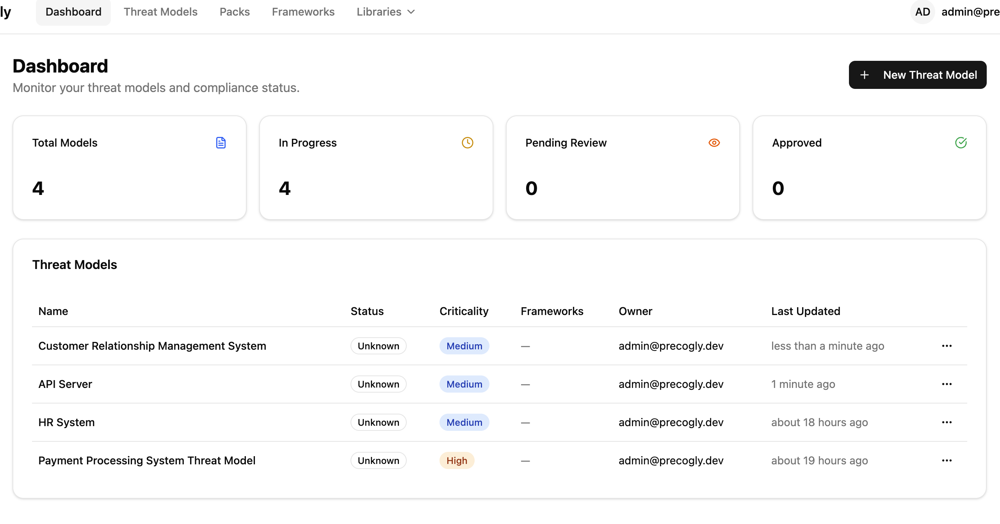
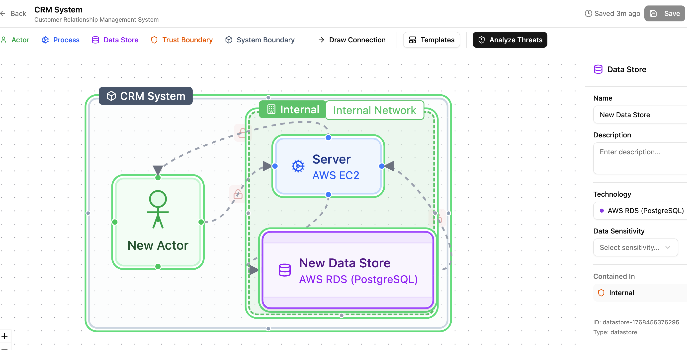
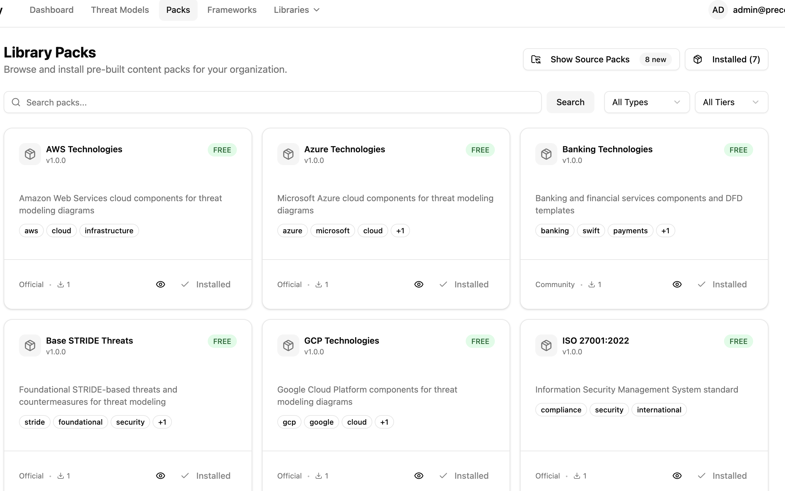
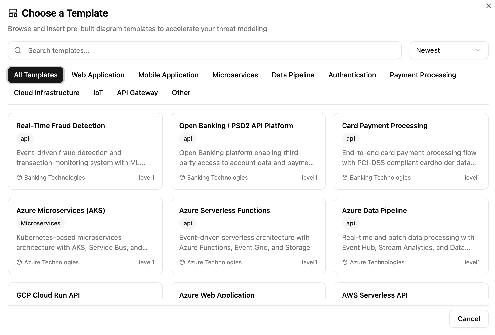
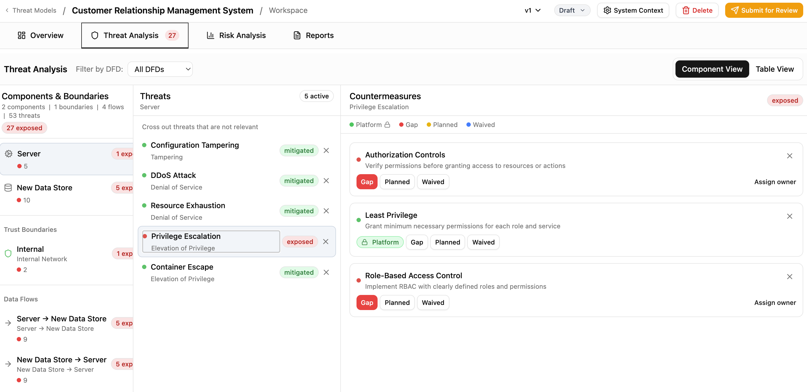

# Precogly

**Open-source, enterprise-grade threat modeling. Community-driven. Community-owned.**

Precogly bridges the gap between basic diagramming tools and expensive commercial platforms — giving AppSec teams a powerful, community-driven, community-owned threat modeling solution.

---

## Why Precogly?

|                                          | Open Source Tools | Commercial Tools | Precogly |
|------------------------------------------|:-----------------:|:----------------:|:--------:|
| Threat Modeling                          | ✅                | ✅               | ✅       |
| Open Source                              | ✅                | ❌               | ✅       |
| Enterprise Support (multi-user, integrations) | ❌           | ✅               | ✅       |
| Compliance Aware                         | ❌                | ✅               | ✅       |

---

## Features

### Enterprise Dashboard

### Visual DFD Editor
Build data flow diagrams with actors, processes, data stores, trust boundaries, and system boundaries — all in an interactive canvas.

### Library Packs
Pre-built collections of technology components with associated threats and countermeasures. Available packs include:

- **Cloud Providers:** AWS, Azure, GCP
- **Frameworks:** Base STRIDE Threats
- **Compliance:** ISO 27001:2022
- **Industry:** Banking Technologies

Install official packs or create your own.

### Community Templates
Start fast with community-curated DFD templates for common architectures: web apps, microservices, payment processing, API gateways, IoT, and more.

### Threat Analysis Workspace
The central hub for each system's threat model. Track completion status, map threats to components, assign countermeasures, and manage team ownership.

---

## Tech Stack

- **Backend:** Django
- **Frontend:** React

---

## Roadmap

| Date | Milestone |
|------|-----------|
| ✅ Jan 15, 2026 | Project announcement |
| 🚀 Feb 12, 2026 | **Public Alpha (v0.1)** — Code drops in this repository |

---

## Get Early Access

Want to test-drive Precogly before the public release?

**[Schedule a demo →](https://calendly.com/vikramsnarayan/30min)** or [email me](vikramsnarayan@gmail.com)

---

## About the Author

Built by [Vikramaditya Narayan](https://www.linkedin.com/in/vikramadityanarayan/) — Certified Threat Modeling Professional (CTMP) and Azure AI Engineer.

---

## Stay Updated

⭐ **Star this repo** to follow the launch.

📬 Questions? [Email me](mailto:vikramsnarayan@gmail.com) or [book a call](https://calendly.com/vikramsnarayan/30min).

---

## License

*License details will be announced at launch.*
