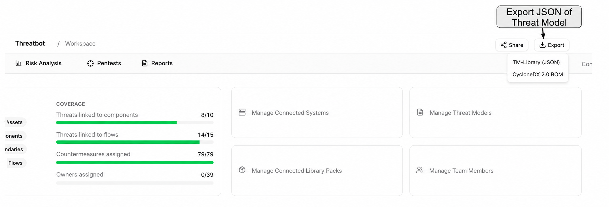
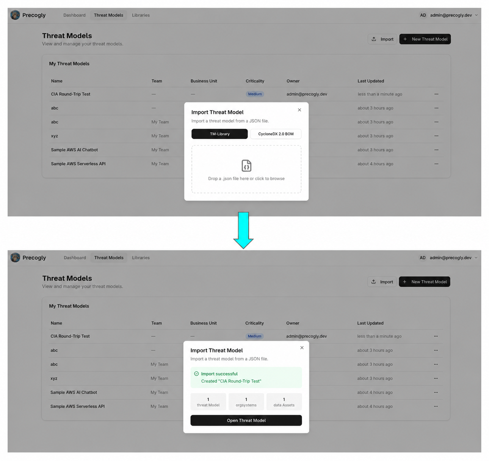

# Threat Model as Code

Precogly lets you export any threat model as a structured JSON file so you can store it in version control, diff changes over time, and integrate threat modeling into your development workflow. The same format can be imported back — making Precogly a two-way bridge between your codebase and your threat models.

Precogly supports two interchange formats:

- **TM-Library (JSON)** — Precogly's native format based on the [OWASP Threat Model Library](https://github.com/OWASP/www-project-threat-model-library) schema, with full round-trip fidelity including extensions for STRIDE tags, compliance mappings, and pack lineage.
- **CycloneDX 2.0 TM-BOM (JSON)** — industry-standard [CycloneDX](https://cyclonedx.org/) BOM format for threat model interchange with the broader CycloneDX ecosystem.

For detailed import/export workflows, format comparisons, and guidance on when to use each format, see [Importing & Exporting](../guides/importing-exporting.md).

## Exporting

From any threat model workspace, click **Export** and select **TM-Library (JSON)** or **CycloneDX (JSON)**. The browser downloads a JSON file named after your threat model.



The export includes everything in your threat model:

- **Scope** — name, description, business criticality
- **Trust zones and boundaries** — with access control and authentication configuration
- **Actors, components, and data stores** — with trust zone assignments and parent relationships
- **Data assets** — sensitivity classifications and placements
- **Data flows** — source, destination, protocol, encryption status
- **Threat personas** — skill level, intent, resources, objectives
- **Threat sources** — linked NIST SP 800-30r1 source categories per threat
- **Threats** — with taxonomy references (STRIDE, CAPEC, CWE, ATT&CK), severity (inherent and residual), and persona/source associations
- **Controls** — status, priority, and linked threats
- **Risks** — likelihood, impact, and score
- **Assumptions** — with validity status
- **Extensions** — Precogly-specific data (severity scoring metadata, STRIDE/ATT&CK taxonomy, compliance mappings, pack lineage)

## Importing

On the Threat Models list page, click **Import** and drag in a JSON file (or use the file picker). Precogly accepts both TM-Library (`.json`) and CycloneDX (`.cdx.json`) files. Precogly creates a new threat model with all entities from the file — components, threats, controls, risks, and their relationships.



After import you'll see a summary of what was created (trust zones, components, threats, controls, etc.) along with any warnings for references that couldn't be resolved.

## TM-Library format

The [OWASP TM-Library format](https://github.com/OWASP/www-project-threat-model-library) is Precogly's native interchange format — a structured JSON schema designed for threat model interchange. Here's the top-level structure:

```json
{
  "version": "1.0",
  "scope": {
    "title": "My API Platform",
    "description": "Public-facing REST API with OAuth2",
    "business_criticality": "high"
  },
  "trust_zones": [...],
  "trust_boundaries": [...],
  "actors": [...],
  "components": [...],
  "data_stores": [...],
  "data_sets": [...],
  "data_flows": [...],
  "threat_personas": [...],
  "threats": [...],
  "controls": [...],
  "risks": [...],
  "assumptions": [...],
  "extensions": { ... }
}
```

Every entity has a `symbolic_name` (a stable identifier like `comp_api_gateway`) that preserves cross-references across import and export. This means you can export, edit the JSON, and re-import without breaking relationships.

## Round-trip fidelity

Precogly preserves TM-Library metadata through round-trips. Core entities — threat personas, threat sources, severity values, CAPEC/CWE references — are stored as first-class database records and exported from live data. Fields that don't map directly to Precogly's data model (like original risk scoring values or extra persona attributes) are stored in `format_metadata` and written back on export. An imported-then-exported file retains the structure and data of the original.

Precogly-specific analytical data (STRIDE/ATT&CK taxonomy, severity scoring metadata, compliance mappings, pack lineage) is carried in a standard `extensions` block keyed by `precogly.org/*` namespaces. Other tools safely ignore this block.

## Version control workflows

Because the export is a single, human-readable JSON file, it fits naturally into existing development workflows:

- **Git history** — commit your threat model alongside code to track how the security analysis evolves with the architecture
- **Pull request reviews** — diff the JSON to review what changed in the threat model before merging
- **Audit trail** — tag releases with a snapshot of the threat model for compliance evidence
- **Templates** — export a well-structured threat model and import it as a starting point for similar projects

## CycloneDX 2.0 TM-BOM

Precogly also supports the [CycloneDX 2.0 Threat Modeling BOM](https://cyclonedx.org/) format. CycloneDX is an industry-standard BOM specification — use it when sharing threat models with tools in the CycloneDX ecosystem or when your organisation standardises on CycloneDX for software supply chain data.

The CycloneDX adapter maps Precogly entities (components, threats, controls, risks, compliance mappings) to CycloneDX 2.0 structures (blueprints, assets, data flows, threats, controls, risks, requirements). See [Importing & Exporting — CycloneDX 2.0 TM-BOM](../guides/importing-exporting.md#cyclonedx-20-tm-bom) for details.

## Interoperability

The adapter architecture is pluggable. Both TM-Library and CycloneDX 2.0 are supported, and additional adapters can be added for other standards.

## Sample files

The repository includes ready-to-import sample threat models from the [OWASP Threat Model Library](https://github.com/OWASP/www-project-threat-model-library) project under [`docs/import-export-formats/Project-TM-Library/`](https://github.com/precogly/precogly/tree/main/docs/import-export-formats/Project-TM-Library):

| File | Description |
|------|-------------|
| `husky-ai-threat-model.json` | ML pipeline with data ingestion, training, and inference |
| `hashicorp-vault-threat-model.json` | Secrets management infrastructure |
| `cryptocurrency-wallet-threat-model.json` | Crypto wallet with key management and transaction signing |
| `ephemeral-browser-isolation-threat-model.json` | Browser isolation platform with session management |
| `kata-containers-threat-model.json` | Container virtualisation isolation layer with threat personas and source references |

Import any of these to explore a fully populated threat model with components, threats, controls, and risks.
