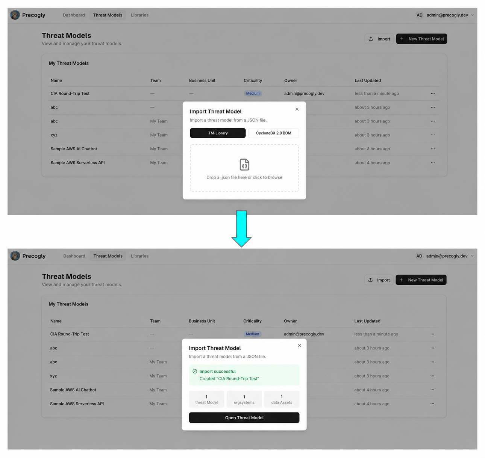

# Threat Model as Code

Precogly lets you export a threat model as structured JSON so you can store it in
version control, review changes, and integrate threat modeling into development
workflows. The one interchange format is the **CycloneDX 2.0 Threat Modeling BOM**
(TM-BOM). Every export validates against the CycloneDX 2.0 schema, and every file in
that shape can be imported, whichever tool wrote it.

## Exporting

From any threat model workspace, click **Export TM-BOM**. The browser downloads a file
named after the model, such as `my-api-cyclonedx-tm-bom.cdx.json`.

The export reads the live model and contains:

- **Identity**: the model's serial number (a UUID URN that never changes), its version,
  the primary system as the document's subject, and the lifecycle phase
- **Blueprints**: one per blueprint, each with its scope and out-of-scope items, zones
  with type and trust level, boundaries with type, crossing requirements and session
  settings, assets (processes, actors, system boxes) with kind, data stores, data sets
  with classification and placements, flows with type, protocol, encryption and
  authentication, assumptions, the DFD canvases as visualizations, and the review block
- **Threats**: abstract threats with taxonomy categories, one scenario per threat with
  its number, targets, actor, triage status, rating (level, score, likelihood and
  impact), and business objectives; the trust boundaries with the scenarios and
  controls at each; the methodologies
- **Controls**: one per countermeasure with its number, status, scope (`appliesTo`),
  providers (`implementedBy`), owner, effectiveness, compliance requirements it
  satisfies, ticket and evidence links, and the threats it mitigates
- **Risks**: status, statement, domains, linked threats and objectives, inherent,
  residual and target ratings, and responses with their strategy, status, cost,
  priority, owner, target date and linked controls
- **Definitions**: business objectives, compliance standards and requirements, use cases
- **Personas** as actors with an attacker party, and parties for reviewers, approvers,
  owners and providers

A threat has one rating; residual risk lives on risks only. Everything Precogly-specific
that has no field in the schema is written as a `precogly:` property.
[Importing and Exporting](../guides/importing-exporting.md) lists every property and
the full mapping.

## Importing

On the Threat Models list page, click **Import** and drop a `.cdx.json` file (or use
the file picker). Precogly creates a new threat model.

Import never rejects a file that is a TM-BOM. It validates the file against the schema,
turns every finding into a warning, stores what it can, and keeps what it cannot store so
the export writes it back. The summary lists the counts and every warning. Review the
warnings before using an imported model as evidence.

## Serial number and version

Every model has a serial number, assigned when it is created and never changed. The
exported document carries it as `serialNumber`, and its `version` goes up only when the
exported content changed since the last export. Together they form a BOM-Link,
`urn:cdx:<serial number>/<version>`, which other documents can use to point at this
model; **Copy BOM-Link** on the model page copies it. Both values are shown read-only
under Advanced in the model's details.

An import always creates a model with a fresh serial number, because the imported copy
will be edited here while the source goes on changing elsewhere. The original serial
number and version are kept, and BOM-Links from other files resolve through them.

## Round-trip fidelity

An export followed by an import gives the same model: the same blueprints, zones,
boundaries, flows, components, threats with their numbers and targets, controls, risks,
objectives, and assumptions. One thing does not survive: an approval. An imported model
starts unapproved, and the source document's approval is shown as history.

Content Precogly does not model (attack trees, attack paths, abuse cases, assessments,
sequence diagrams, properties from other tools, unknown fields) is kept as received and
written back on export. If something such content points at is deleted in between, the
stale reference is removed on export and the export warns.

Always review the import summary and compare a re-export when exact fidelity is
required, especially when exchanging data with a different tool.

## Version control workflows

Because the export is a single, human-readable JSON file, it fits naturally into existing development workflows:

- **Git history**: commit your threat model alongside code to track how the security analysis evolves with the architecture
- **Pull request reviews**: diff the JSON to review what changed in the threat model before merging
- **Audit trail**: tag releases with a snapshot of the threat model for compliance evidence
- **Templates**: export a well-structured threat model and import it as a starting point for similar projects

The threat and control numbers stay the same across exports, so a diff of two versions shows which scenario changed.

## Interoperability

Precogly's adapter reads and writes the CycloneDX 2.0 schema as pinned in the
repository (see [Importing and Exporting](../guides/importing-exporting.md) for the
commit). Files from other tools import with warnings for whatever Precogly has no place
for; Precogly's own files open in any tool that reads the schema, and that tool can
ignore the `precogly:` properties.

The earlier TM-Library format is no longer supported, in either direction. The
[guest editor](../guides/guest-editor.md) reads and writes the same TM-BOM shape, so a file moves
between it and the signed-in workspace with nothing lost.

## Sample files

The repository's reference document,
[`backend/apps/threat_models/tests/fixtures/tmbom/reference-model.cdx.json`](https://github.com/precogly/precogly/blob/main/backend/apps/threat_models/tests/fixtures/tmbom/reference-model.cdx.json),
is a complete valid export that touches every section above. The
[AI Threat Model Generation](../guides/ai-threat-model-generation.md) guide has a smaller
hand-written example.
